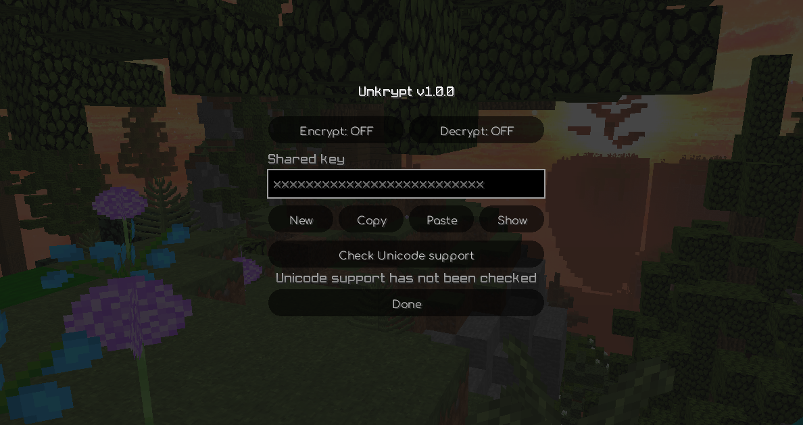
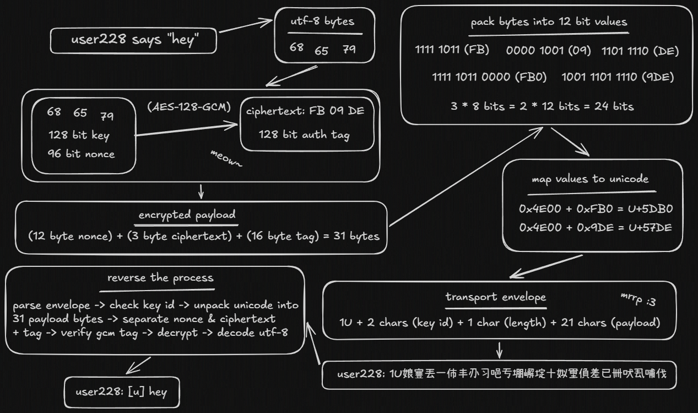

# unkrypt

forge 1.8.9 mod that adds AES-128-GCM encryption and unicode packing to users' messages

*inspired by the expansion of big bro surveillance and ai message filtering on servers (wdym i cannot meow??!)*

## usage

there is only one command for now: `/unkrypt` which is used to open mod settings and let you configure the states and shared key



to start a private conversation simply share your key with the selected person (or ask them to share theirs). using external channels like discord or whatnot is preferred for key sharing cause in-game ones might very well be read by the server staff

P.S. unkrypt doesn't store any configs on your machine, decrypted messages aren't written to the logs either

## installation 

you can either install the `.jar` from the releases or build the mod yourself by cloning the repository and running:

### windows

```
.\gradlew.bat build
```

### linux

```
./gradlew build
```

after building, the `.jar` file will be inside `./build/libs` directory regardless of your operating system

## if curious

<details>
<summary>encryption flowchart</summary>


</details>

## disclaimer

created for educational purposes only. the author is not responsible for misuse of the mod or any resulting consequences

## contributions

are welcome 
